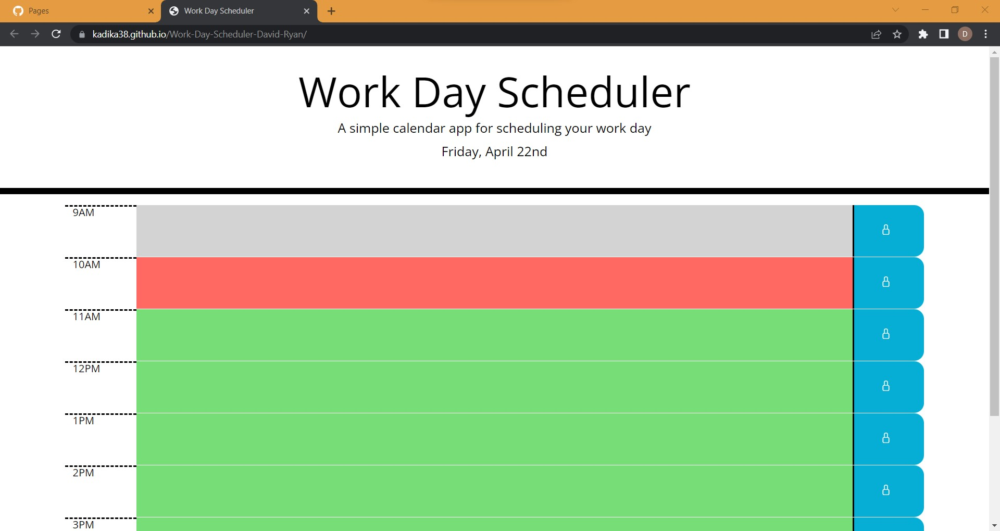

## <Work-Day-Scheduler-David-Ryan>
Bootcamp Homework 05 Work Day Scheduler:\
A simple calendar application that allows a user to save events for each hour of the day.

## Description

This is a simple calendar scheduling application.  The user can create and save events throughout a normal 9-5 workday.

Upon first opening of the page, a title and simple description for the upper part of the page.  They are followed by a dynamically generated display of the current day.  This is shown using moment.js so that it is accurate for every user.  Below this is a set of elements consisting of an hour of the day, a (upon first load) blank element that takes up roughly 70% of the space, and a save button that uses a lock icon.  The elements and icon are elements from Bootstrap.  The centered element that takes up the most space is color coded based on the current time.  If that time block has not passed yet, it will show as green.  If it has passed, it will show as gray.  If it is the current hour time block, it will show as red.  This process is completed using moment.js to compare the current time with each time block.  Each time block is a text input that the user can click on and type in.  If the user clicks on the save button, represented as a lock icon in the blue right side element, the corresponding time block will be saved in local storage.  The lock icon will also grow slightly when the mouse hoverrs over it.  When the page loads, it will check the local storage and populate the timeblocks with any earlier saved input.  It does not store anything unless a corresponding save button has been clicked.  Save buttons only save their corresponding time block input, and have no effect on other time blocks.

Moment.js only updates the date display and color coding of the time blocks on page load.  These will not update as time passes without a page reload.

Time block input can be saved and rewritten as many times as the user wants.  Blank space can also be saved.

## Screenshot

## Link to Deployed Website

https://kadika38.github.io/Work-Day-Scheduler-David-Ryan/